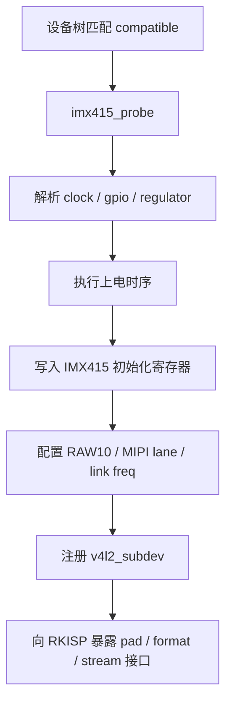
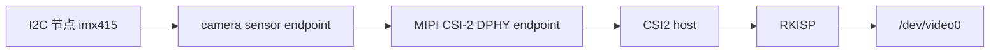
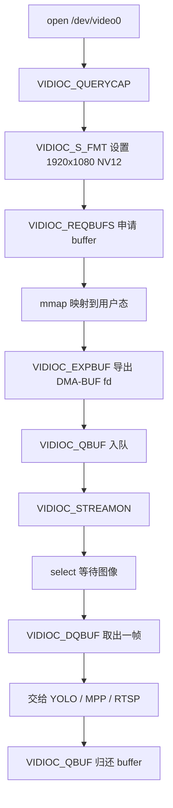
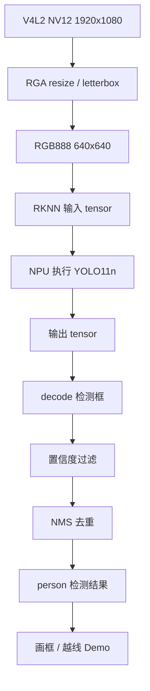
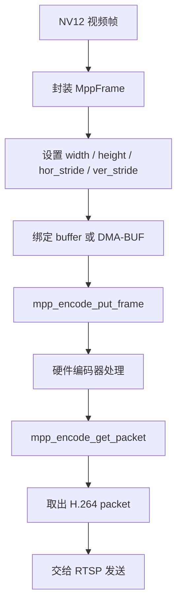
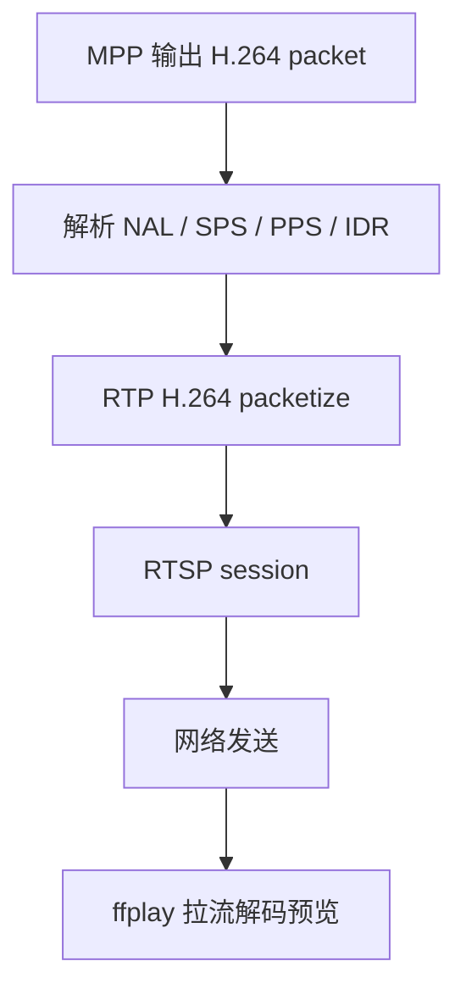
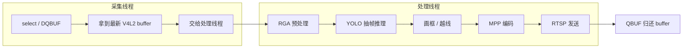

# RK3566 IMX415 智能监控项目代码讲解

本文档用于说明本仓库中每个代码模块的作用、实现流程以及它在完整视频链路中的位置。它更偏向项目复盘和面试讲解，不是逐行源码注释。

## 1. 项目整体链路

本项目实现的是 RK3566 端侧视频采集、AI 推理、H.264 编码和 RTSP 推流链路。完整流程如下：


仓库代码按职责拆成三类：

- `sensor_driver/`：IMX415 摄像头驱动、设备树 overlay、MIPI DPHY 调试参考。
- `rtsp_streaming/`：不带 YOLO 的基础 V4L2 采集、MPP 编码、RTSP 推流链路。
- `yolo_integration/`：带 YOLO11n RKNN 推理、检测结果叠加和低延迟优化的完整链路。

## 2. Sensor 驱动部分

相关代码：

- `sensor_driver/imx415.c`
- `sensor_driver/overlays/*.dts`
- `sensor_driver/dphy_reference/*`

这部分负责让 Linux 内核识别 IMX415 摄像头，并把它注册成 V4L2 subdev。驱动本身不直接给应用层输出图像，而是完成 sensor 上电、寄存器配置、MIPI CSI-2 输出、格式协商和 stream 控制，后续由 RKISP mainpath 暴露 `/dev/video0` 给应用层使用。



面试讲法：

> 我负责把 IMX415 接到 RK3566 的 media pipeline 里，驱动侧主要做 V4L2 subdev 适配，包括设备树匹配、上电时序、寄存器表配置、pad ops 格式协商、v4l2_ctrl 曝光增益控制，以及 stream on/off。最终目标是让 RKISP 能稳定拿到 IMX415 的 RAW10 数据。

重点理解：

- `probe`：驱动入口，完成资源获取和 subdev 注册。
- `power_on / power_off`：控制 sensor 电源、reset、clock。
- `s_stream`：应用层开始采集时，驱动写寄存器并启动 sensor 输出。
- `pad ops`：告诉上游 RKISP 当前 sensor 输出分辨率、格式和链路参数。

## 3. 设备树部分

相关代码：

- `sensor_driver/overlays/rk356x-lubancat-csi0-imx415-overlay.dts`
- `sensor_driver/overlays/rk356x-lubancat-csi0-imx415-4lane-overlay.dts`

设备树负责描述硬件连接关系，让内核知道 IMX415 挂在哪个 I2C 总线上、使用哪些 GPIO、clock、regulator，以及 MIPI CSI-2 的 endpoint 怎么和 DPHY / ISP 连接。



面试讲法：

> 驱动能不能 probe 成功不只看 C 文件，还依赖设备树。设备树里要把 I2C 地址、reset/pwdn GPIO、时钟、供电和 MIPI endpoint 配好。media graph 连通以后，RKISP 才能把 sensor 输出映射成应用层可访问的视频节点。

重点理解：

- `compatible` 必须和驱动中的匹配表一致。
- `reg` 是 sensor 的 I2C 地址。
- `data-lanes` 决定 MIPI lane 数。
- `remote-endpoint` 决定 sensor、dphy、isp 之间的 media graph 连接。

## 4. V4L2 采集部分

相关代码：

- `rtsp_streaming/v4l2_capture.c`
- `rtsp_streaming/v4l2_capture.h`
- `rtsp_streaming/imx415_rtsp.c`
- `yolo_integration/imx415_yolo_rtsp.cpp`

应用层通过 V4L2 从 `/dev/video0` 获取 RKISP 输出的 NV12 帧。当前采用 mmap buffer，并导出 DMA-BUF fd，方便后续 MPP 编码器使用。



面试讲法：

> 应用层用 V4L2 标准接口取帧，先设置 NV12 1920x1080 格式，然后申请 mmap buffer，把内核 buffer 映射到用户态。每一帧通过 DQBUF 取出，处理完成后 QBUF 归还。为了降低旧帧排队，我把 V4L2 buffer 数量从 4 个减少到 2 个。

重点理解：

- `DQBUF` 表示应用层拿到一帧。
- `QBUF` 表示应用层把 buffer 还给驱动继续采集。
- buffer 太多会增加排队延迟，buffer 太少可能导致丢帧，需要根据链路耗时权衡。
- 当前目标是低延迟预览，因此优先减少排队。

## 5. YOLO11n 端侧部署部分

相关代码：

- `yolo_integration/imx415_yolo_rtsp.cpp`
- `yolo_integration/rknn_yolo11/yolo11.h`
- `yolo_integration/rknn_yolo11/yolo11_zero_copy.cc`
- `yolo_integration/rknn_yolo11/postprocess.cc`
- `yolo_integration/rknn_utils/image_utils.c`
- `yolo_integration/rknn_utils/image_drawing.c`

YOLO 部分使用 RK 官方转换好的 YOLO11n INT8 RKNN 模型，部署到 RK3566 NPU 上运行。应用层把 V4L2 取到的 NV12 图像通过 RGA 做 resize / letterbox，再送入 RKNN 执行推理，最后做阈值过滤和 NMS，得到检测框。



面试讲法：

> YOLO 这块我做的是端侧部署和链路集成，不是重新训练模型。模型来自 RK 官方 model zoo，已经转成 INT8 RKNN。我的工作是把摄像头帧接入 RKNN 推理链路，完成 RGA 预处理、RKNN 推理、后处理、检测框叠加，并结合耗时统计做抽帧推理优化。

当前优化策略：

- 使用 YOLO11n，属于 YOLO11 系列最轻量模型。
- 使用 INT8 RKNN 模型，适合 RK3566 NPU。
- 每 3 帧执行一次真实 YOLO 推理，其余帧复用最近一次检测结果。
- 只保留项目需要的类别和后处理结果，减少无意义处理。

需要坦诚说明：

- 越线检测目前是 Demo 级功能，本质是基于检测框中心点和固定警戒线做简单判断。
- 模型不是自己训练的，重点是模型部署、链路集成和性能优化。

## 6. MPP H.264 编码部分

相关代码：

- `rtsp_streaming/mpp_encoder.c`
- `rtsp_streaming/mpp_encoder.h`
- `rtsp_streaming/imx415_rtsp.c`
- `yolo_integration/imx415_yolo_rtsp.cpp`

MPP 部分负责把 NV12 视频帧送入 RK3566 的硬件编码器，输出 H.264 码流。项目中使用 H.264 Baseline + CAVLC，降低编码复杂度，适合低延迟 RTSP 预览。



面试讲法：

> 编码侧使用 Rockchip MPP，把 NV12 帧送进硬件 H.264 encoder。低延迟优化上，我主要调整了编码配置，使用 Baseline + CAVLC，减少复杂编码工具带来的耗时，同时尽量减少应用层 memcpy，让编码后的 H.264 packet 直接进入 RTSP 发送。

重点理解：

- MPP 输入通常是 NV12。
- H.264 输出不是图片，而是一段段编码后的 packet。
- RTSP 推流发送的是编码后的 H.264 NAL 数据。
- 编码耗时已经比较低，后续优化空间小于 YOLO 推理和帧排队。

## 7. RTSP / RTP 推流部分

相关代码：

- `rtsp_streaming/rtsp_demo.c`
- `rtsp_streaming/rtsp_demo.h`
- `rtsp_streaming/rtsp_msg.c`
- `rtsp_streaming/rtp_enc.c`
- `rtsp_streaming/stream_queue.c`
- `rtsp_streaming/imx415_rtsp.c`
- `yolo_integration/imx415_yolo_rtsp.cpp`

RTSP 模块负责建立 RTSP session，把 MPP 输出的 H.264 数据按 RTP 包发送出去。PC 端可以使用 ffplay 拉流预览。



面试讲法：

> RTSP 这块是把编码器输出的 H.264 码流封装成 RTP 包，通过 RTSP session 发给客户端。测试阶段我用 ffplay 在局域网内拉流，验证端侧采集、编码、推流链路是否稳定。

常用拉流命令：

```bash
ffplay -fflags nobuffer -flags low_delay -framedrop rtsp://192.168.1.20:8554/live
```

## 8. 多线程与低延迟优化

相关代码：

- `yolo_integration/imx415_yolo_rtsp.cpp`
- `rtsp_streaming/queue.h`
- `rtsp_streaming/stream_queue.c`

最初链路是偏串行的：取帧、YOLO、画框、编码、推流都在一条主流程里执行。问题是某个环节耗时过高时，V4L2 buffer 会排队，应用层拿到的可能不是最新帧。

优化后思路是把采集和处理解耦，尽量让采集线程快速拿到最新帧，处理线程负责推理、画框、编码和推流。



面试讲法：

> 延迟优化不是只看单个函数，而是看整条 pipeline。我的做法是先加时间戳统计，确认耗时主要来自 V4L2 排队和 YOLO 推理，然后分别处理：V4L2 减少 buffer 数量，YOLO 做抽帧推理，MPP 去掉冗余拷贝并降低编码复杂度，最后把采集和处理拆成多线程，减少旧帧堆积。

优化结果：

- 初始端到端延迟约 213 到 216 ms。
- 优化后典型端到端延迟约 71 ms。
- 编码部分耗时已经降到较低水平，主要优化空间集中在模型推理、帧排队和客户端播放缓冲。

## 9. 代码和能力对应关系

| 能力点 | 对应代码 | 能讲的重点 |
| --- | --- | --- |
| IMX415 驱动适配 | `sensor_driver/imx415.c` | V4L2 subdev、上电、寄存器、pad ops、stream 控制 |
| 设备树适配 | `sensor_driver/overlays/*.dts` | I2C、GPIO、clock、MIPI endpoint、media graph |
| V4L2 采集 | `rtsp_streaming/v4l2_capture.c` | mmap、REQBUFS、DQBUF、QBUF、DMA-BUF |
| H.264 编码 | `rtsp_streaming/mpp_encoder.c` | MPP encoder、NV12 输入、H.264 packet 输出 |
| RTSP 推流 | `rtsp_streaming/rtsp_demo.c`、`rtsp_streaming/rtp_enc.c` | RTSP session、RTP 打包、ffplay 验证 |
| YOLO 部署 | `yolo_integration/imx415_yolo_rtsp.cpp`、`rknn_yolo11/` | RKNN 模型加载、RGA 预处理、NPU 推理、后处理 |
| 低延迟优化 | `yolo_integration/imx415_yolo_rtsp.cpp` | 时间戳统计、抽帧推理、减少 buffer 排队、多线程 |

## 10. 简历上建议怎么写

推荐写法：

> 基于 RK3566 + IMX415 构建端侧智能监控视频链路，完成 IMX415 V4L2 subdev 驱动适配、V4L2 采集、RKNN YOLO11n 端侧部署、MPP H.264 硬件编码与 RTSP 推流；通过 pipeline 分段打点定位延迟瓶颈，采用 V4L2 buffer 缩减、YOLO 抽帧推理、编码配置优化和多线程解耦，将端到端延迟由约 213 ms 降低至约 71 ms。

面试时建议主动强调：

- 自己负责的是 RK3566 端侧链路，不把服务端和客户端说成自己实现。
- YOLO 模型来自 RK 官方，自己的工作是部署、集成、打点和优化。
- 越线检测目前是 Demo，可以作为功能验证点，不建议包装成复杂算法项目。

