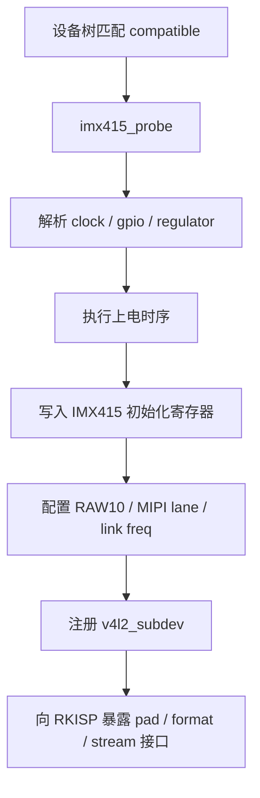
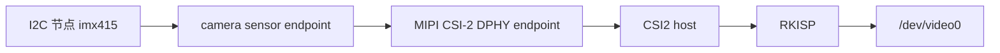
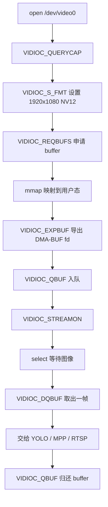
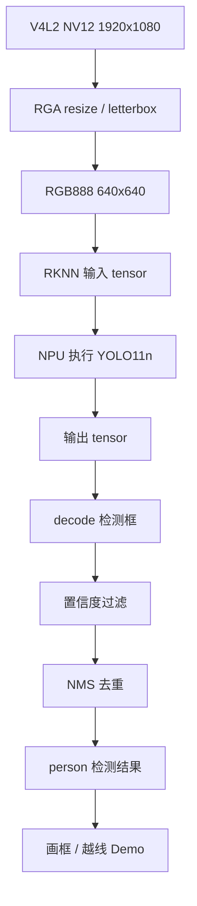
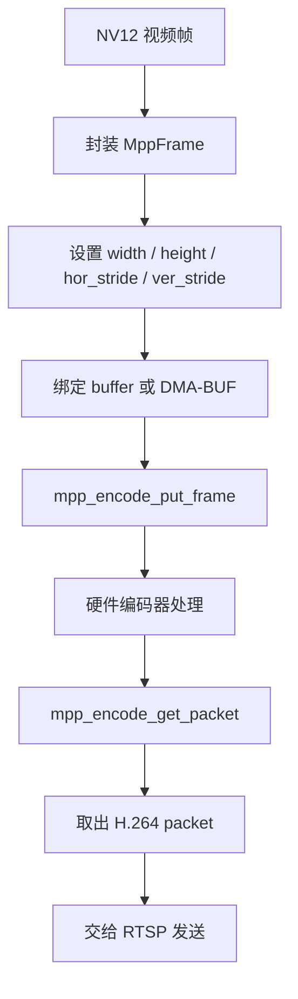
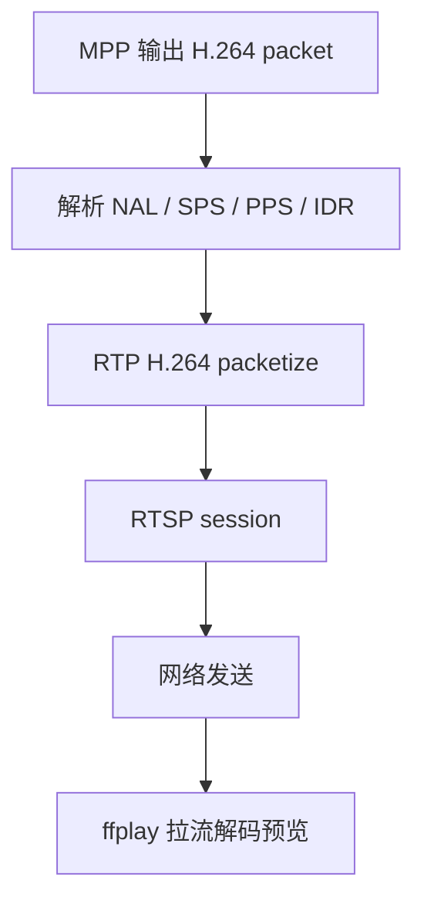

# RK3566 IMX415 智能监控项目代码讲解

本文档用于说明本仓库中每个代码模块的作用、实现流程以及它在完整视频链路中的位置。它更偏向项目复盘和面试讲解，不是逐行源码注释。

**当前代码（`latest-pending`）：** 1080p60、4 个 V4L2 DMA-BUF、视频线程与 AI 线程并行。默认 `latest-pending`：仅帧 0/4/8 拷贝 NV12 进单槽 pending；叠框 RGA 与 MPP 共用 V4L2 fd；AI 侧另一路 RGA 把副本缩成 640×640 RGB 再 `rknn_run`。仓库根目录 [README.md](../README.md) 是默认配置的权威说明。下文驱动/设备树部分仍然适用；采集 buffer 数量、抽帧策略以 README 为准，不要再按「2 buffer / 每 3 帧 / 71 ms 端到端」讲当前实现。

## 1. 项目整体链路

本项目实现的是 RK3566 端侧视频采集、AI 推理、H.264 编码和 RTSP 推流链路。当前默认流程如下：

```text
IMX415 RAW10 → CSI → RKISP 1080p60 NV12
  → 采集线程 DQBUF（4× dma-buf）
  → 视频线程：到期帧 memcpy 到 pending → 叠框 RGA → MPP H.264 → QBUF → RTSP
  → AI 线程（并行）：pending→work → 缩放 RGA → rknn_run → 发布框
```

仓库代码按职责拆成三类：

- `sensor_driver/`：IMX415 摄像头驱动、设备树 overlay、MIPI DPHY 调试参考。
- `rtsp_streaming/`：不带 YOLO 的基础 V4L2 采集、MPP 编码、RTSP 推流链路。
- `yolo_integration/`：带 YOLO11n RKNN 推理、检测结果叠加和低延迟优化的完整链路。

## 2. Sensor 驱动部分

相关代码：

- `sensor_driver/imx415.c`
- `sensor_driver/overlays/*.dts`
- `sensor_driver/dphy_reference/*`

这部分负责让 Linux 内核识别 IMX415 摄像头，并把它注册成 V4L2 subdev。驱动本身不直接给应用层输出图像，而是完成 sensor 上电、寄存器配置、MIPI CSI-2 输出、格式协商和 stream 控制，后续由 RKISP mainpath 暴露 `/dev/video0` 给应用层使用。


```mermaid
flowchart TD
    A["设备树匹配 compatible"] --> B["imx415_probe"]
    B --> C["解析 clock / gpio / regulator"]
    C --> D["执行上电时序"]
    D --> E["写入 IMX415 初始化寄存器"]
    E --> F["配置 RAW10 / MIPI lane / link freq"]
    F --> G["注册 v4l2_subdev"]
    G --> H["向 RKISP 暴露 pad / format / stream 接口"]
```

面试讲法：

> 我负责把 IMX415 接到 RK3566 的 media pipeline 里，驱动侧主要做 V4L2 subdev 适配，包括设备树匹配、上电时序、寄存器表配置、pad ops 格式协商、v4l2_ctrl 曝光增益控制，以及 stream on/off。最终目标是让 RKISP 能稳定拿到 IMX415 的 RAW10 数据。

重点理解：

- `probe`：驱动入口，完成资源获取和 subdev 注册。
- `power_on / power_off`：控制 sensor 电源、reset、clock。
- `s_stream`：应用层开始采集时，驱动写寄存器并启动 sensor 输出。
- `pad ops`：告诉上游 RKISP 当前 sensor 输出分辨率、格式和链路参数。

## 3. 设备树部分

相关代码：

- `sensor_driver/overlays/rk356x-lubancat-csi0-imx415-overlay.dts`
- `sensor_driver/overlays/rk356x-lubancat-csi0-imx415-4lane-overlay.dts`

设备树负责描述硬件连接关系，让内核知道 IMX415 挂在哪个 I2C 总线上、使用哪些 GPIO、clock、regulator，以及 MIPI CSI-2 的 endpoint 怎么和 DPHY / ISP 连接。


```mermaid
flowchart LR
    A["I2C 节点 imx415"] --> B["camera sensor endpoint"]
    B --> C["MIPI CSI-2 DPHY endpoint"]
    C --> D["CSI2 host"]
    D --> E["RKISP"]
    E --> F["/dev/video0"]
```

面试讲法：

> 驱动能不能 probe 成功不只看 C 文件，还依赖设备树。设备树里要把 I2C 地址、reset/pwdn GPIO、时钟、供电和 MIPI endpoint 配好。media graph 连通以后，RKISP 才能把 sensor 输出映射成应用层可访问的视频节点。

重点理解：

- `compatible` 必须和驱动中的匹配表一致。
- `reg` 是 sensor 的 I2C 地址。
- `data-lanes` 决定 MIPI lane 数。
- `remote-endpoint` 决定 sensor、dphy、isp 之间的 media graph 连接。

## 4. V4L2 采集部分

相关代码：

- `rtsp_streaming/v4l2_capture.c`
- `rtsp_streaming/v4l2_capture.h`
- `rtsp_streaming/imx415_rtsp.c`
- `yolo_integration/imx415_yolo_rtsp.cpp`

应用层通过 V4L2 从 `/dev/video0` 获取 RKISP 输出的 NV12 帧。当前采用 mmap buffer，并导出 DMA-BUF fd，方便后续 MPP 编码器使用。


```mermaid
flowchart TD
    A["open /dev/video0"] --> B["VIDIOC_QUERYCAP"]
    B --> C["VIDIOC_S_FMT 设置 1920x1080 NV12"]
    C --> D["VIDIOC_REQBUFS 申请 buffer"]
    D --> E["mmap 映射到用户态"]
    E --> F["VIDIOC_EXPBUF 导出 DMA-BUF fd"]
    F --> G["VIDIOC_QBUF 入队"]
    G --> H["VIDIOC_STREAMON"]
    H --> I["select 等待图像"]
    I --> J["VIDIOC_DQBUF 取出一帧"]
    J --> K["交给 YOLO / MPP / RTSP"]
    K --> L["VIDIOC_QBUF 归还 buffer"]
```

面试讲法：

> 应用层用 V4L2 标准接口取帧，设置 NV12 1920x1080，申请 mmap buffer 并 EXPBUF 导出 dma-buf fd。DQBUF 拿到帧，叠框和 MPP 编码共用这块 fd，编码完成后再 QBUF。当前默认是 4 个 buffer：2 个时 ISP 经常没排队 buffer 可写，采集会被应用拖到约 40 fps；4 个后采集回到 60 fps。

重点理解：

- `DQBUF` 表示应用层拿到一帧。
- `QBUF` 表示应用层把 buffer 还给驱动继续采集。
- DMA-BUF 路径下必须等 MPP 用完再 QBUF，否则 ISP 会改正在编码的页。
- buffer 太少丢采集，太多会堆旧帧；当前权衡是 4 个。

## 5. YOLO11n 端侧部署部分

相关代码：

- `yolo_integration/imx415_yolo_rtsp.cpp`
- `yolo_integration/rknn_yolo11/yolo11.h`
- `yolo_integration/rknn_yolo11/yolo11_zero_copy.cc`
- `yolo_integration/rknn_yolo11/postprocess.cc`
- `yolo_integration/rknn_utils/image_utils.c`
- `yolo_integration/rknn_utils/image_drawing.c`

YOLO 部分使用 RK 官方转换好的 YOLO11n INT8 RKNN 模型，部署到 RK3566 NPU 上运行。视频线程只在到期帧（默认每 4 帧）把 NV12 拷进 pending；AI 线程用缩放 RGA 做 letterbox（1080p NV12 → 640×640 RGB）写入 RKNN 输入 dma-buf，再 `rknn_run`。叠框是视频线程上另一路 RGA，写的是 V4L2 那块 1080p，不要和预处理缩放混成一次 RGA。


```mermaid
flowchart TD
    A["V4L2 NV12 1920x1080"] --> B["RGA resize / letterbox"]
    B --> C["RGB888 640x640"]
    C --> D["RKNN 输入 tensor"]
    D --> E["NPU 执行 YOLO11n"]
    E --> F["输出 tensor"]
    F --> G["decode 检测框"]
    G --> H["置信度过滤"]
    H --> I["NMS 去重"]
    I --> J["person 检测结果"]
    J --> K["画框 / 越线 Demo"]
```

面试讲法：

> YOLO 这块我做的是端侧部署和链路集成，不是重新训练模型。模型来自 RK 官方 model zoo，已经转成 INT8 RKNN。我的工作是把摄像头帧接入 RKNN 推理链路，完成 RGA 预处理、RKNN 推理、后处理、检测框叠加，并结合耗时统计做抽帧推理优化。

当前优化策略：

- 使用 YOLO11n INT8 RKNN，适合 RK3566 NPU。
- 默认 `latest-pending`：仅帧 0/4/8 拷贝；NPU 忙则覆盖单槽 pending，结束后立刻接着推。
- 其余视频帧复用最近检测结果叠框，编码不等 NPU。
- 可用 `PERF_SUBMIT_POLICY=latest_if_idle` 回到「忙则跳过、不预存」（S4 实测配置是间隔 5）。

需要坦诚说明：

- 越线检测目前是 Demo 级功能，本质是基于检测框中心点和固定警戒线做简单判断。
- 模型不是自己训练的，重点是模型部署、链路集成和性能优化。

## 6. MPP H.264 编码部分

相关代码：

- `rtsp_streaming/mpp_encoder.c`
- `rtsp_streaming/mpp_encoder.h`
- `rtsp_streaming/imx415_rtsp.c`
- `yolo_integration/imx415_yolo_rtsp.cpp`

MPP 部分负责把 NV12 视频帧送入 RK3566 的硬件编码器，输出 H.264 码流。项目中使用 H.264 Baseline + CAVLC，降低编码复杂度，适合低延迟 RTSP 预览。


```mermaid
flowchart TD
    A["NV12 视频帧"] --> B["封装 MppFrame"]
    B --> C["设置 width / height / hor_stride / ver_stride"]
    C --> D["绑定 buffer 或 DMA-BUF"]
    D --> E["mpp_encode_put_frame"]
    E --> F["硬件编码器处理"]
    F --> G["mpp_encode_get_packet"]
    G --> H["取出 H.264 packet"]
    H --> I["交给 RTSP 发送"]
```

面试讲法：

> 编码侧使用 Rockchip MPP，把 NV12 帧送进硬件 H.264 encoder。低延迟优化上，我主要调整了编码配置，使用 Baseline + CAVLC，减少复杂编码工具带来的耗时，同时尽量减少应用层 memcpy，让编码后的 H.264 packet 直接进入 RTSP 发送。

重点理解：

- MPP 输入通常是 NV12。
- H.264 输出不是图片，而是一段段编码后的 packet。
- RTSP 推流发送的是编码后的 H.264 NAL 数据。
- 编码耗时已经比较低，后续优化空间小于 YOLO 推理和帧排队。

## 7. RTSP / RTP 推流部分

相关代码：

- `rtsp_streaming/rtsp_demo.c`
- `rtsp_streaming/rtsp_demo.h`
- `rtsp_streaming/rtsp_msg.c`
- `rtsp_streaming/rtp_enc.c`
- `rtsp_streaming/stream_queue.c`
- `rtsp_streaming/imx415_rtsp.c`
- `yolo_integration/imx415_yolo_rtsp.cpp`

RTSP 模块负责建立 RTSP session，把 MPP 输出的 H.264 数据按 RTP 包发送出去。PC 端可以使用 ffplay 拉流预览。


```mermaid
flowchart TD
    A["MPP 输出 H.264 packet"] --> B["解析 NAL / SPS / PPS / IDR"]
    B --> C["RTP H.264 packetize"]
    C --> D["RTSP session"]
    D --> E["网络发送"]
    E --> F["ffplay 拉流解码预览"]
```

面试讲法：

> RTSP 这块是把编码器输出的 H.264 码流封装成 RTP 包，通过 RTSP session 发给客户端。测试阶段我用 ffplay 在局域网内拉流，验证端侧采集、编码、推流链路是否稳定。

常用拉流命令：

```bash
ffplay -fflags nobuffer -flags low_delay -framedrop rtsp://192.168.1.20:8554/live
```

## 8. 多线程与低延迟优化

相关代码：

- `yolo_integration/imx415_yolo_rtsp.cpp`
- `rtsp_streaming/queue.h`
- `rtsp_streaming/stream_queue.c`

最初链路是偏串行的：取帧、YOLO、画框、编码、推流都在一条主流程里执行。问题是某个环节耗时过高时，V4L2 buffer 会排队，应用层拿到的可能不是最新帧。

优化后思路是把采集、视频（叠框/编码/推流）、AI 拆开。采集只负责 DQBUF 并交出最新帧；视频线程不等 NPU；AI 线程只处理到期拷贝进来的 NV12。

当前默认（见 README）：

```text
采集线程  DQBUF → 最新帧指针给视频线程
视频线程  到期 memcpy pending → 叠框 RGA → MPP → QBUF → RTSP
AI 线程   pending→work → 缩放 RGA → rknn_run → 发布框
```

面试讲法：

> 延迟优化不是只看单个函数，而是看整条 pipeline。采集和编码走 4 个 DMA-BUF，叠框和 MPP 共用 fd，编码完再 QBUF。YOLO 大约 65 ms 一次，不能同步挡 16.7 ms 的视频拍；所以只按每 4 帧拷一份进 pending，NPU 忙就覆盖这一张，推完立刻接着用。旧版 2 个 buffer 会把采集拖到约 40 fps，4 个才回到 60。

历史优化结果（2026-07 同步/30fps 口径，不是当前默认）：

- 初始端到端延迟约 213 到 216 ms。
- 当时多线程版本约 71 ms（含到 RTSP 发送，不是显示端到端）。
- 当前板内「采集时间戳→编码输出」P95 约 15 ms，来自 S4 实测配置，见 README。
- 编码部分耗时已经降到较低水平，主要优化空间集中在模型推理、帧排队和客户端播放缓冲。

## 9. 代码和能力对应关系

| 能力点 | 对应代码 | 能讲的重点 |
| --- | --- | --- |
| IMX415 驱动适配 | `sensor_driver/imx415.c` | V4L2 subdev、上电、寄存器、pad ops、stream 控制 |
| 设备树适配 | `sensor_driver/overlays/*.dts` | I2C、GPIO、clock、MIPI endpoint、media graph |
| V4L2 采集 | `rtsp_streaming/v4l2_capture.c` | mmap、REQBUFS、DQBUF、QBUF、DMA-BUF |
| H.264 编码 | `rtsp_streaming/mpp_encoder.c` | MPP encoder、NV12 输入、H.264 packet 输出 |
| RTSP 推流 | `rtsp_streaming/rtsp_demo.c`、`rtsp_streaming/rtp_enc.c` | RTSP session、RTP 打包、ffplay 验证 |
| YOLO 部署 | `yolo_integration/imx415_yolo_rtsp.cpp`、`rknn_yolo11/` | RKNN 模型加载、RGA 预处理、NPU 推理、后处理 |
| 低延迟优化 | `yolo_integration/imx415_yolo_rtsp.cpp` | Frame ID、4 DMA-BUF、latest-pending、周期 IDR / RTP 游标 |

## 10. 简历上建议怎么写

推荐写法（数字用已测配置，并说清边界）：

> 基于 RK3566 + IMX415 打通 1080p60 V4L2 / DMA-BUF / MPP / RTSP；YOLO 与视频线程解耦，到期帧拷入单槽 pending。S4 实测采集 60 fps、编码约 58.7 fps，采集时间戳到编码输出 P95 约 14.9 ms（板内，非显示端到端）。

不要把 213→71 ms 当作当前默认实现。那是更早的 30 fps 同步链路口径。

面试时建议主动强调：

- 自己负责的是 RK3566 端侧链路，不把服务端和客户端说成自己实现。
- YOLO 模型来自 RK 官方，自己的工作是部署、集成、打点和优化。
- 越线检测目前是 Demo，可以作为功能验证点，不建议包装成复杂算法项目。

